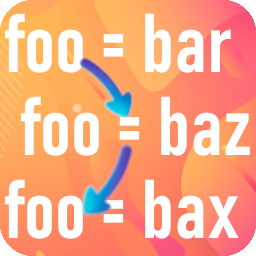

# Jump To Next Assignment

Jump to the next line where the selected variable is assigned.

Default shortcut: `ALT+a` (can be changed in Settings)

(Note that it only searches for explicit assignments in the code, variables might as well be assigned through dereference or other means)

# Supported languages

- Any language that uses `=` to assign a variable (default).
- default: `=`
- r: `<-`
- cobol: `==`
- sql: `:=`
- css: `:`
- yaml: `:`
- json: `:`
- vhdl: [`:=`, `<=`]
- verilog: `=`
- systemverilog: `=`

Please create a PR or open a new Issue in GitHub if you would like to request support for other languages or syntax!

# Shortcuts

| Shortcut | Functionality |  Default |
|----------|----------| ----------|
| jumpToNextAssignment.jumpToNextAssignment   | Jump to the next place where the selected variable is assigned   |  `ALT+a`  |

# Settings

| Setting | Functionality |  Default |
|----------|----------| ----------|
| jumpToNextAssignment.allowCharsBeforeAssignOp   | Allows other non-whitespace characters between the variable name and the assignment. This catches `foo` in expressions such as destructuring assignments like `[foo, bar] = result` (might catch some false positives though).     Can be disabled to catch only expressions like `foo <whitespace(s)> = result`  |  `true` |
